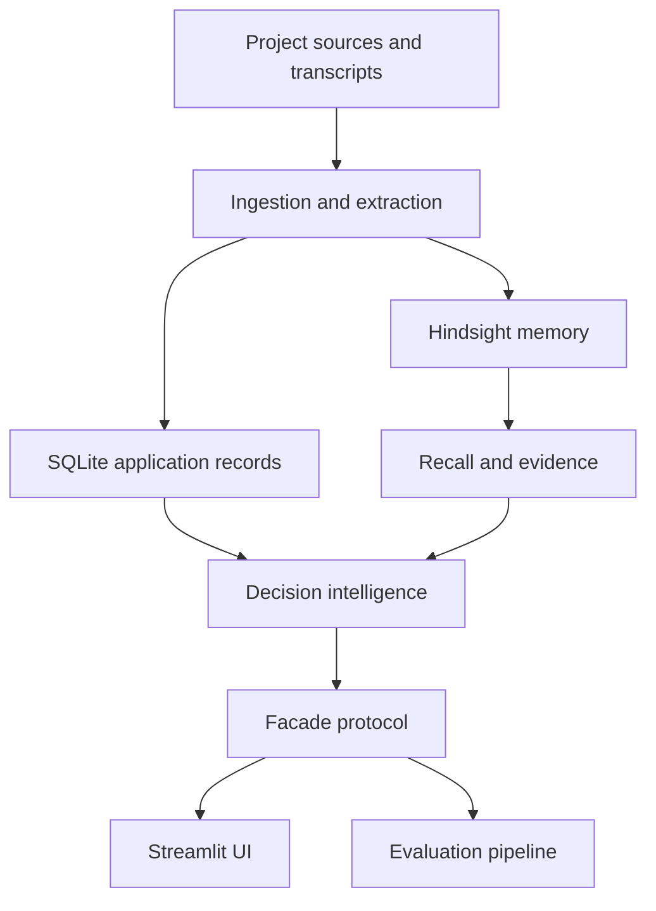

# DecisionPrint

DecisionPrint is an organizational decision-memory system. It connects engineering decisions to the reasons and constraints behind them, the evidence they came from, and the outcomes that followed. When a new project faces a similar choice, DecisionPrint compares the old context with the current one and surfaces what may have changed.

The project uses [Hindsight](https://github.com/vectorize-io/hindsight) as its long-term memory engine. A deterministic application layer adds canonical decision records, access scope, constraint comparison, and traceable evidence. The Streamlit app brings those capabilities together in a demo-ready workflow.

## What It Does

- Ingest project documents and transcripts, retain evidence, and extract decisions, constraints, context, and outcomes.
- Recall historical decisions and build source-backed briefs for new questions.
- Compare past and current constraints to identify Decision Drift without treating every changed circumstance as an automatic reversal.
- Trace decisions through project timelines and later incidents or outcomes.
- Consolidate evidence into evolving observations and mental models.
- Enforce role-based project scope in the facade and show memory, decision, and evidence views in the UI.

The included fictional Northstar Systems corpus demonstrates several cases: Kafka's original rejection and later reconsideration as project needs change; a GraphQL rejection that remains valid despite growth; Redis scaling; adoption of distributed tracing; and a backup decision linked to a later incident.

## Architecture



The facade is the boundary between the interface and the backends. `DP_BACKEND=fixture` uses deterministic demo data; `DP_BACKEND=live` selects the connected Hindsight-backed implementation. The fixture mode is the default and is suitable for exploring the UI without configuring external services.

## Quickstart

### Requirements

- Python 3.11 or newer
- Git

### Install

```bash
git clone https://github.com/Kyogesh308/DecisionPrint.git
cd DecisionPrint
python -m venv .venv
```

Activate the environment, then install all project dependencies and the package in editable mode:

```powershell
# Windows PowerShell
.venv\Scripts\Activate.ps1
pip install -r requirements.txt -r requirements/p2.txt -r requirements/p3.txt
pip install -e .
Copy-Item .env.example .env
```

```bash
# Linux/macOS
source .venv/bin/activate
pip install -r requirements.txt -r requirements/p2.txt -r requirements/p3.txt
pip install -e .
cp .env.example .env
```

The example environment selects fixture mode (`DP_BACKEND=fixture`). Start the app with:

```bash
streamlit run ui/app.py
```

Open [http://localhost:8501](http://localhost:8501).

### Live memory and LLM services

To use connected services, set `DP_BACKEND=live` in `.env` and configure the Hindsight endpoint, API key, and bank ID, along with the LLM provider, model, and API key. The variable names and defaults are documented in `.env.example`. Keep credentials out of source control. The fixture backend does not require these services.

## Product Workflow

1. **Retain evidence:** ingest historical project artifacts and current project material.
2. **Build context:** extract decisions, reasons, assumptions, constraints, and outcomes, preserving source references.
3. **Recall and compare:** retrieve relevant memory for a question and compare historical constraints with the active project context.
4. **Review the brief:** inspect the drift signal, confidence, timeline, and source evidence before making a decision.
5. **Learn from outcomes:** connect later incidents or results to prior decisions and update organizational observations.

## Application Areas

The Streamlit app includes an overview, question-and-answer flow, current projects, timeline, decision explorer, memory evolution, outcome chain, and settings. Access is mediated by user role; the demo distinguishes engineer, project lead, executive, and admin scopes.

## Verification

Run the complete test suite and lint the application and supporting code:

```bash
pytest -q
ruff check contracts memory ingestion store facade intelligence eval ui scripts tests
```

The tests are organized by project area:

- `tests/p1/` covers memory, storage, facade behavior, seeding, and hardening.
- `tests/p2/` covers extraction, briefs, drift, causal classification, LLM behavior, and evaluation.
- `tests/p3/` covers adapters, fixture data, manifest and gold data, UI smoke tests, themes, and visualizations.

Validate the synthetic corpus manifest separately with:

```bash
python -m scripts.p3.manifest
```

## Repository Map

| Path                    | Responsibility                                                               |
| ----------------------- | ---------------------------------------------------------------------------- |
| `contracts/`            | Shared models, enums, errors, identifiers, and the facade protocol           |
| `memory/`, `store/`     | Hindsight client and cache; local application persistence                    |
| `ingestion/`, `facade/` | Source ingestion and the application-facing backend interface                |
| `intelligence/`         | Extraction, briefs, constraint comparison, drift, outcomes, and causal links |
| `eval/`                 | Evaluation models, metrics, pipeline, and runner                             |
| `ui/`                   | Streamlit application, pages, components, and fixture/live adapters          |
| `data/`                 | Source manifest, historical/current corpus, and evaluation gold data         |
| `scripts/`              | Setup, seeding, cache, and corpus utilities grouped by project area          |
| `tests/`                | P1, P2, and P3 tests and fixtures                                            |
| `requirements/`         | Dependency sets for the shared base and P1/P2/P3 areas                       |

## Project Documents

- [Product requirements](DecisionPrint_PRD.md) describe the product goals, memory model, and Hindsight-centered architecture.
- [MVP plan](plan.md) records project scope and implementation phases.
- [P1 platform notes](P1_Memory_Platform_Engineer.md) cover memory, persistence, ingestion, and integration conventions.
- [P2 notes](docs/p2_notes.md) document intelligence and LLM implementation decisions.
- [P3 technical article](article.md) and [PDF edition](article.pdf) discuss the data and UI perspective.
- [Intelligence blog](intelligence_blog.md) provides additional project context.
