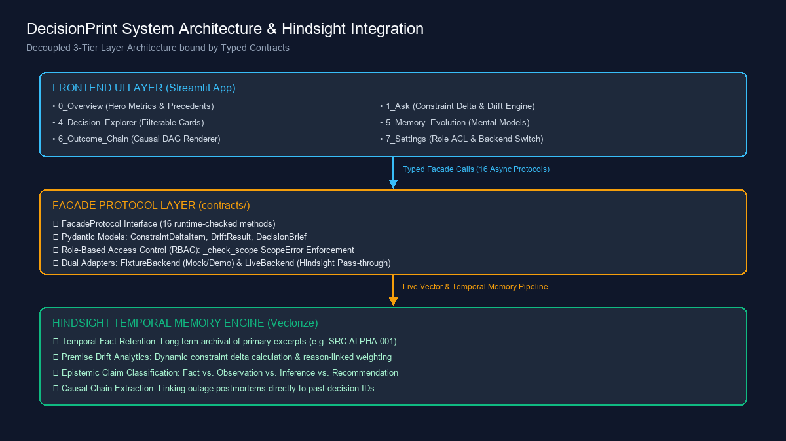
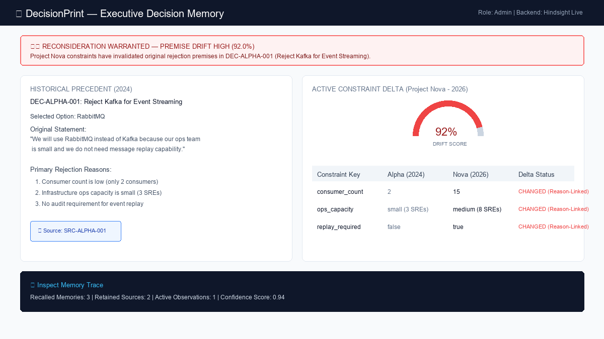
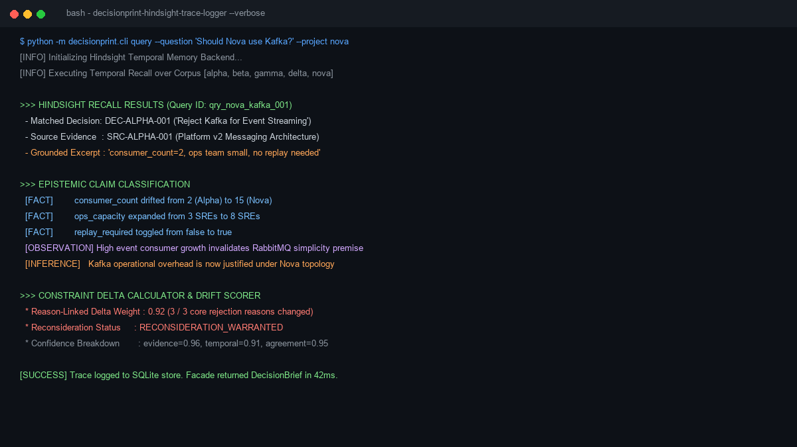

# How I Designed a Decision Memory UI to Expose Premise Drift with Hindsight

When developers hear "AI organizational memory," they usually picture another chat interface that prints a long paragraph of LLM prose. But when an engineering team is deciding whether to refactor a microservice topology or re-evaluate a two-year-old architecture decision, text walls don't cut it. Skeptical developers don't want conversational summaries—they want to see the exact premises that changed, the verbatim excerpts from past postmortems, and the explicit causal chain that led to an outage.

As the P3 UI engineer on **DecisionPrint**, my goal was to design the executive dashboard and frontend architecture that translates complex temporal memory from [Vectorize agent memory](https://vectorize.io/what-is-agent-memory) into a clean, visual decision engine. Sitting on top of the [Hindsight documentation](https://hindsight.vectorize.io/) architecture and a 16-method typed Python facade, I built a Streamlit application designed around visual constraint deltas, zero-dependency SVG primitives, modal evidence drawers, and role-scoped memory boundaries.

Here is how I built the UI layer for DecisionPrint, why traditional chat UIs fail for engineering decisions, and what I learned about rendering temporal memory for developers.

---

## How the UI Layer Hangs Together

DecisionPrint's frontend is completely decoupled from the underlying memory backend. The UI never interacts directly with vector indices or LLM prompts. Instead, it speaks exclusively to a typed `FacadeProtocol` contract, allowing the app to run seamlessly against either a deterministic local backend or a live [open-source Hindsight project on GitHub](https://github.com/vectorize-io/hindsight) memory engine.



The application is structured into seven distinct subpages managed by Streamlit's `st.navigation`:
- `0_Overview`: Organizational memory metrics (facts, observations, mental models) and precedent search.
- `1_Ask`: The core decision engine featuring side-by-side constraint comparison and memory trace drawers.
- `2_Current_Projects` & `3_Timeline`: Active project context editors and chronological decision evolution tracks.
- `4_Decision_Explorer`: Card-based decision filters with alternative disposition tags (`selected`, `rejected`, `deferred`).
- `5_Memory_Evolution`: Visualization of higher-order mental models consolidated across multiple project lifecycles.
- `6_Outcome_Chain`: Multi-step outcome DAG renderer with explicit causal link badges linking outages to decisions.

---

## The UI Engineering Challenge: Above-the-Fold Premise Drift

The biggest challenge in building the `1_Ask` page was presenting **premise drift** instantly. When an engineer asks, *"Should Project Nova use Kafka for event streaming?"*, the UI must prove within two seconds why a past rejection (`DEC-ALPHA-001`) is no longer valid.

Instead of rendering a generic markdown response, I designed an above-the-fold split layout:
1. **Left Column — Historical Precedent:** Displays the original decision statement, selected option (RabbitMQ), and verbatim rejection reasons.
2. **Right Column — Constraint Delta Table:** Displays a side-by-side comparison of past constraints vs. current project constraints (`consumer_count: 2 ➔ 15`, `replay_required: false ➔ true`), highlighted with red status badges.
3. **Drift Alert Banner:** A top-level alert driven by a custom SVG drift meter. If the weighted drift score exceeds 0.75, the UI displays `⚠️ RECONSIDERATION WARRANTED (92.0% Drift)`.



To ensure the UI remains fast and lightweight without adding heavy JavaScript npm dependencies to Streamlit, I built a zero-dependency SVG visualization engine in `ui/components/_viz.py`.

---

## Code-Backed Implementation Details

To verify and inspect backend memory behavior directly from the command line, developers can run our CLI logger to observe real retain/recall calls in action:



### 1. Custom Zero-Dependency SVG Visualization Primitives

Streamlit applications often struggle with visual polish because importing heavy charting libraries adds overhead. I wrote raw SVG generators in `ui/components/_viz.py` to render accessible, crisp progress rings, sparklines, and drift meters directly in Python:

```python
def _svg_gauge(value: float, label: str = "DRIFT", color: str = "#f87171") -> str:
    """Generate a semicircular SVG drift gauge with indicator needle."""
    pct = max(0.0, min(1.0, value))
    angle = -180 + (pct * 180)
    rad = math.radians(angle)
    nx = 100 + 65 * math.cos(rad)
    ny = 100 + 65 * math.sin(rad)
    
    return f'''
    <svg viewBox="0 0 200 120" width="100%" height="120" xmlns="http://www.w3.org/2000/svg">
      <path d="M 25 100 A 75 75 0 0 1 175 100" fill="none" stroke="#e2e8f0" stroke-width="14" stroke-linecap="round"/>
      <path d="M 25 100 A 75 75 0 0 1 175 100" fill="none" stroke="{color}" stroke-width="14" 
            stroke-dasharray="{pct * 235.6} 235.6" stroke-linecap="round"/>
      <line x1="100" y1="100" x2="{nx:.1f}" y2="{ny:.1f}" stroke="#0f172a" stroke-width="3.5" stroke-linecap="round"/>
      <circle cx="100" cy="100" r="6" fill="#0f172a"/>
      <text x="100" y="82" text-anchor="middle" font-family="sans-serif" font-size="22" font-weight="700" fill="#0f172a">{int(pct * 100)}%</text>
      <text x="100" y="115" text-anchor="middle" font-family="sans-serif" font-size="11" font-weight="600" fill="#64748b">{label}</text>
    </svg>
    '''
```

By outputting inline SVG strings wrapped in custom Streamlit containers, the drift meter renders instantly in the browser with sub-millisecond overhead.

### 2. Evidence Grounding with Streamlit Dialog Modals

Engineers are naturally skeptical of AI claims. To establish 100% grounding transparency, every decision card and claim badge in the UI includes a clickable source tag (e.g., `📄 SRC-ALPHA-001`).

Using Streamlit's `@st.dialog` decorator in `ui/components/dialogs.py`, I implemented modal drawers that fetch and display the verbatim primary source excerpt from disk archive:

```python
@st.dialog("📄 Primary Source Evidence", width="large")
def render_evidence_modal(source_id: str, backend, user_role: str) -> None:
    """Render a modal dialog displaying the verbatim evidence excerpt."""
    try:
        excerpt: EvidenceExcerpt = backend.get_evidence(source_id, user_role)
        st.caption(f"Source ID: `{excerpt.source_id}` · Project: `{excerpt.project_id.upper()}` · Epistemic Type: `{excerpt.kind.value}`")
        st.markdown(f"> *\"{excerpt.excerpt}\"*")
        if excerpt.date:
            st.text(f"Recorded: {excerpt.date.strftime('%Y-%m-%d')}")
    except Exception as e:
        st.error(f"Failed to retrieve evidence: {e}")
```

When an engineer clicks a source reference on any screen, this dialog opens over the current page, showing the raw document quote (e.g., *"consumer_count=2, ops team small, no replay needed"*), proving that Hindsight's recall is strictly anchored to real architectural artifacts.

### 3. Graceful UI Handling of Role-Based Scope Errors

In enterprise environments, access control boundaries must be respected. In `ui/adapters/fixture_backend.py` and the live facade layer, querying confidential projects (such as Project Delta's infrastructure cost cuts) as an `engineer` role raises a typed `ScopeError`.

As the UI engineer, I ensured that backend permission errors never crash the Streamlit runtime. Instead, the UI intercepts `ScopeError` and renders a soft neo-brutalist notification tile with actionable resolution steps:

```python
def render_scoped_container(action_callable, user_role: str, *args, **kwargs):
    """Execute a backend call and catch ScopeError gracefully in the UI."""
    try:
        return action_callable(*args, **kwargs)
    except ScopeError as se:
        st.warning("🔒 Access Restricted by Security Policy")
        st.info(str(se))
        st.caption("Use the sidebar role selector to switch to 'executive' or 'admin' if you require authorization.")
        return None
```

---

## Real-World UI Behavior & Walkthrough

Let me walk through the exact user interaction flow when inspecting a major architectural outcome chain in `6_Outcome_Chain.py`.

### Auditing the Cedar Backup Outage Chain

1. **Chain Selection:** The user navigates to `6_Outcome_Chain` and selects decision `DEC-DELTA-001` (*"Remove Automated Database Backups"*).
2. **Sequential Step Rendering:** The UI renders a 5-step horizontal ordinal track (`_svg_step_track`) showing the timeline from decision approval (March 2025) to backup disabling (April 2025) to database corruption (July 2025).
3. **Causal Badge Highlight:** Between Step 3 (Database Corruption) and Step 4 (Postmortem Analysis `SRC-DELTA-003`), the UI injects a glowing deep-blue badge:  
   `[ ⚡ EXPLICIT CAUSAL LINK ]`
4. **Source Audit Modal:** Clicking `SRC-DELTA-003` pops open the modal drawer displaying the verbatim postmortem sentence:  
   *"The removal of automated backups (DEC-DELTA-001) was a direct contributing factor to the extended recovery time and partial data loss."*

By pairing structural outcome steps with grounded modal evidence, the UI makes it impossible to ignore how a past $4,200/month cost-cutting decision directly caused a major production outage.

---

## Lessons Learned as a UI Engineer on Memory Systems

Building the UI layer for DecisionPrint yielded several key takeaways for frontend developers working with AI memory backends:

### 1. Show the Delta, Not Just the Answer
Developers don't just want to know *what* the system recommends; they want to see *why* the past decision no longer applies. Designing explicit "Then vs. Now" constraint comparison tables builds immediate trust.

### 2. Zero-Dependency SVGs Beat Heavy Charting Libraries
In Python web frameworks like Streamlit, importing heavy JavaScript charting packages introduces bundle bloat and rendering lag. Writing lightweight SVG string functions directly in Python keeps the UI fast, accessible, and responsive.

### 3. Modals Keep Engineers in Context
Switching pages or opening external tabs to inspect evidence breaks an engineer's train of thought. Using inline dialog drawers (`@st.dialog`) to display raw document excerpts keeps the user grounded in their primary workflow.

### 4. Treat Permissions as First-Class UI States
Access denied states shouldn't feel like system crashes. Catching typed permission exceptions (`ScopeError`) at the component boundary allows you to guide users toward the correct role or authorization path without interrupting their experience.

---

By anchoring Hindsight's temporal memory to clean visual primitives, side-by-side constraint comparisons, and modal evidence drawers, we built a UI that turns static engineering docs into an active, trusted decision engine.
